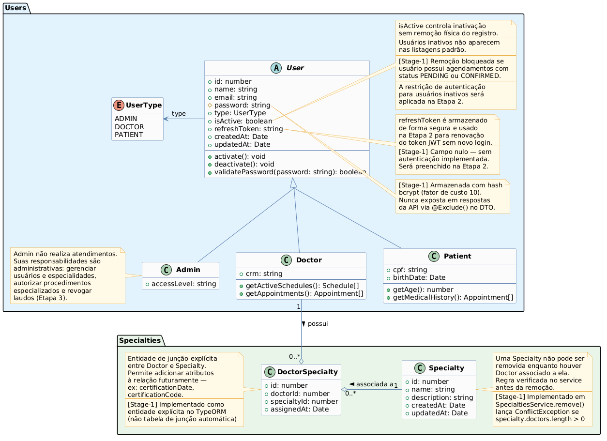
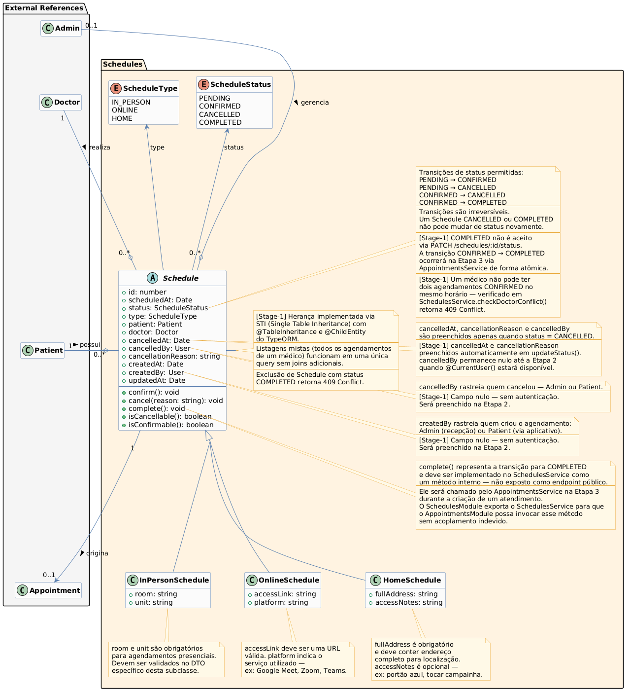

# Relatório — Stage 1 — SGCM

## 1. Integrantes e Contribuições

| Integrante | Contribuições |
|---|---|
| Brener Martins | Implementação dos módulos Users(doctors), Specialties, estrutura base do projeto, herança STI |
| Breno Maeda | Atuou como Tester (QA) da etapa, responsável pelos testes manuais das rotas via Swagger, validação rigorosa das regras de negócio (como conflitos de agendamento) e garantia da qualidade dos fluxos da API | 
| Higor Morais Vieira | Implementação dos módulos Users(Patients, Admins e Users - Base), Schedules |

## 2. Diagrama de Classes

### Usuários e Especialidades

### Agendamentos

## 3. Decisões Técnicas

### Estratégia de herança (STI) para User e Schedule
**Alternativas consideradas:** STI (Single Table Inheritance) e CTI (Class Table Inheritance).  
**Decisão:** STI para ambas as hierarquias.  
**Justificativa:** O TypeORM com SQLite tem suporte mais estável para STI. Listagens mistas (todos os usuários, todos os agendamentos) são feitas em uma única query sem joins, o que simplifica o código e melhora a performance para o volume esperado.

### Granularidade dos controllers
**Alternativas consideradas:** Um único UsersController ou controllers separados por perfil.  
**Decisão:** Controllers separados — UsersController, DoctorsController, PatientsController.  
**Justificativa:** Rotas mais expressivas (/doctors, /patients), DTOs de resposta específicos por perfil e documentação Swagger mais clara por recurso.

### Exportação do UsersService para outros módulos
**Alternativas consideradas:** Exportar o UsersService completo ou criar um service auxiliar.  
**Decisão:** Exportar o UsersService completo.  
**Justificativa:** Para o escopo atual o custo de criar um service auxiliar supera o benefício. O UsersModule exporta o UsersService e o SchedulesModule o importa para validar médico e paciente no momento do agendamento.

### Verificação de unicidade no service
**Decisão:** Verificar no service antes de persistir, lançando ConflictException explícita.  
**Justificativa:** Mensagens de erro mais descritivas e controle total sobre o fluxo. A possibilidade de race condition foi aceita dado o contexto acadêmico do projeto.

### Entidade de junção explícita DoctorSpecialty
**Decisão:** Usar entidade explícita em vez de tabela de junção automática do TypeORM.  
**Justificativa:** Permite adicionar atributos à relação futuramente (ex: certificationDate) sem reescrita, conforme previsto no diagrama base do enunciado.

### Repositório genérico vs customizado
**Decisão:** Repository<T> genérico para operações simples, QueryBuilder para consultas com filtros combinados (findAll de schedules).  
**Justificativa:** Evita criar classes de repositório desnecessárias mantendo as queries complexas organizadas no service.

### Remoção vs inativação de usuários
**Decisão:** Inativação via campo isActive.  
**Justificativa:** Preserva o histórico de agendamentos. Usuários inativos não aparecem nas listagens padrão. A restrição de login para usuários inativos será aplicada na Etapa 2.

### O que caracteriza agendamento "ativo"
**Decisão:** Agendamentos com status PENDING ou CONFIRMED são considerados ativos para fins de bloqueio de remoção de usuário.

### cancelledBy e createdBy nesta etapa
**Decisão:** Campos existem no modelo mas são deixados nulos nesta etapa.  
**Justificativa:** Sem autenticação implementada não há como identificar o usuário autenticado. Serão preenchidos via @CurrentUser() na Etapa 2.

### DTOs por modalidade ou DTO único para Schedule
**Decisão:** DTO único (CreateScheduleDto) com validação condicional no service.  
**Justificativa:** Simplifica o endpoint POST /schedules. A validação dos campos específicos por modalidade é feita no método validateScheduleTypeFields do service.

### Fator de custo do bcrypt
**Decisão:** Fator 10.  
**Justificativa:** Valor padrão amplamente adotado, equilibra segurança e performance para o contexto da aplicação.

### synchronize: true vs migrations
**Decisão:** synchronize: true nesta etapa.  
**Justificativa:** Adequado para desenvolvimento com banco compartilhado no repositório. Migrations serão avaliadas nas próximas etapas conforme o schema se estabiliza.

## 4. Dificuldades e Aprendizados

- **Herança com TypeORM e SQLite:** O comportamento do STI com SQLite exigiu atenção na configuração dos decorators @TableInheritance e @ChildEntity para que as queries polimórficas funcionassem corretamente.
- **Serialização com ClassSerializerInterceptor:** Garantir que os DTOs de resposta excluíssem campos sensíveis (password, refreshToken) em todas as rotas exigiu revisão cuidadosa de cada DTO.
- **Filtro de exceção RFC 7807:** Adaptar o formato padrão do NestJS para o formato RFC 7807 exigiu tratamento especial para os erros do ValidationPipe, que retornam um array de mensagens.
- **Dependências entre módulos:** Estruturar a dependência do SchedulesModule no UsersModule sem criar acoplamento excessivo foi o principal desafio arquitetural desta etapa.

---

# Stage 2 — Autenticação, Autorização e Infraestrutura Transversal

## 1. Integrantes e Contribuições

| Integrante | Contribuições |
|---|---|
| Higor | AuthModule completo (login, refresh, logout, /auth/me), estratégia JWT, guards, decorators (@Public, @Roles, @CurrentUser, @Auth), controle de acesso por recurso nos services, proteção de todos os endpoints existentes |
| Breno | Exception filter 401/403 |
| Brener | Middleware de logging, Transform Interceptor, correções de controllers (PUT), endpoint GET /specialties/:id/doctors, atualização de README e .env.example  |

## 2. Diagrama de Classes

O diagrama da Etapa 1 permanece válido — nenhuma entidade foi alterada estruturalmente nesta etapa. O campo `refreshToken` em `User`, previsto desde a Etapa 1, passou a ser utilizado nesta etapa para armazenar o hash do refresh token.

## 3. Decisões Técnicas

### Guards globais — estratégia opt-out com @Public()
**Decisão:** `JwtAuthGuard` e `RolesGuard` registrados como `APP_GUARD` globais no `AppModule`.
**Justificativa:** Todos os endpoints são protegidos por padrão. Endpoints públicos declaram explicitamente `@Public()`. Elimina o risco de esquecer de proteger um endpoint novo na Etapa 3.

### Payload do token JWT
**Campos incluídos:** `sub` (id do usuário), `email`, `type` (perfil).
**Justificativa:** Suficientes para identificar o usuário e verificar permissões sem consultar o banco. `email` incluído para rastreabilidade nos logs. Dados clínicos, senha e refreshToken deliberadamente excluídos — o payload pode ser decodificado por qualquer pessoa.

### Armazenamento do refresh token
**Decisão:** Armazenado com hash SHA-256 no banco.
**Justificativa:** Em caso de comprometimento do banco, os tokens não podem ser reutilizados diretamente. A comparação no `/auth/refresh` aplica o hash ao token recebido antes de comparar com o armazenado.

### Refresh token rotation
**Decisão:** Implementado — cada uso do refresh token gera um novo par de tokens e invalida o anterior.
**Justificativa:** Permite detectar reutilização de tokens. Se um token já utilizado for apresentado novamente, significa possível comprometimento.

### Tempos de expiração
**Token de acesso:** 15 minutos — curto para limitar a janela de risco em caso de interceptação.
**Refresh token:** 7 dias — equilibra segurança com usabilidade em um sistema clínico onde sessões longas são esperadas.

### Verificação do usuário no banco a cada requisição
**Decisão:** Não verificado — a estratégia JWT valida apenas o token em memória.
**Justificativa:** Evita uma consulta ao banco por requisição. A limitação — usuário inativado após login continua com acesso até o token expirar — é mitigada pelo tempo de expiração curto (15min).

### Controle por perfil vs controle por recurso
**Controle por perfil:** Implementado nos guards via `@Roles()` — verifica o tipo do usuário antes do handler.
**Controle por recurso:** Implementado nos services — verifica se o recurso pertence ao usuário autenticado após o handler ser chamado.

### Tabela de controle de acesso

| Recurso | Admin | Doctor | Patient | Controle por recurso |
|---|---|---|---|---|
| POST /users | ✅ | ❌ | ❌ | — |
| GET /users | ✅ | ❌ | ❌ | — |
| GET /users/{id} | ✅ | ✅ | ✅ | Próprio usuário |
| PUT /users/{id} | ✅ | ✅ | ✅ | Próprio usuário |
| DELETE /users/{id} | ✅ | ❌ | ❌ | — |
| GET /doctors | ✅ | ✅ | ✅ | — |
| GET /doctors/{id} | ✅ | ✅ | ✅ | — |
| GET /doctors/{id}/specialties | ✅ | ✅ | ✅ | — |
| POST /doctors/{id}/specialties | ✅ | ❌ | ❌ | — |
| DELETE /doctors/{id}/specialties/{id} | ✅ | ❌ | ❌ | — |
| GET /doctors/{id}/schedules | ✅ | ✅ | ❌ | Doctor: próprios |
| GET /patients | ✅ | ❌ | ❌ | — |
| GET /patients/{id} | ✅ | ❌ | ✅ | Patient: próprio |
| GET /patients/{id}/schedules | ✅ | ❌ | ✅ | Patient: próprios |
| POST /specialties | ✅ | ❌ | ❌ | — |
| GET /specialties | ✅ | ✅ | ✅ | — |
| GET /specialties/{id} | ✅ | ✅ | ✅ | — |
| PUT /specialties/{id} | ✅ | ❌ | ❌ | — |
| DELETE /specialties/{id} | ✅ | ❌ | ❌ | — |
| GET /specialties/{id}/doctors | ✅ | ✅ | ✅ | — |
| POST /schedules | ✅ | ❌ | ✅ | Patient: próprio |
| GET /schedules | ✅ | ❌ | ❌ | — |
| GET /schedules/{id} | ✅ | ✅ | ✅ | Doctor/Patient: próprios |
| PUT /schedules/{id} | ✅ | ❌ | ❌ | — |
| PATCH /schedules/{id}/status | ✅ | ❌ | ✅ | Patient: apenas cancelar próprio |
| DELETE /schedules/{id} | ✅ | ❌ | ❌ | — |
| POST /auth/login | Público | Público | Público | — |
| POST /auth/refresh | Público | Público | Público | — |
| GET /auth/me | ✅ | ✅ | ✅ | Sempre próprio |
| POST /auth/logout | ✅ | ✅ | ✅ | Sempre próprio |

### Middleware de logging
**Decisão:** Middleware registrado globalmente via `forRoutes('*')`. Captura tempo de processamento via evento `finish` do objeto `Response`.
**Formato:** Legível para humanos — `[timestamp] METHOD URL - STATUS - Xms - IP: x.x.x.x`.
**Justificativa:** Formato legível adequado para o contexto de desenvolvimento. Em produção o formato JSON seria mais adequado para ferramentas de monitoramento.

### Transform Interceptor
**Decisão:** Registrado globalmente em `main.ts` após o `ClassSerializerInterceptor`.
**Detecção de listagens:** Verifica se a resposta possui `data[]` e `meta` — se sim, enriquece o `meta` existente com `timestamp` e `path` sem duplicar camadas.
**Respostas vazias:** Retorna `null/undefined` sem transformação para preservar o 204 No Content.

### Dependência entre AuthModule e UsersModule
**Decisão:** `AuthModule` importa `UsersModule` — unidirecional, sem dependência circular.
**Justificativa:** O `UsersModule` exporta o `UsersService` que o `AuthService` usa para verificar credenciais. O `UsersModule` não depende do `AuthModule`.

### Mensagens de erro de autenticação
**Decisão:** Mensagens distintas por cenário (token expirado, inválido, ausente) implementadas no `handleRequest` do `JwtAuthGuard`.
**Credenciais incorretas:** Mensagem genérica "E-mail ou senha incorretos" — protege contra enumeração de usuários.

### Rate limiting
**Decisão:** Não implementado nesta etapa.
**Reconhecimento do risco:** O endpoint `POST /auth/login` está suscetível a ataques de força bruta. Em produção seria necessário implementar `@nestjs/throttler` com limite por IP.

## 4. Limitações Conhecidas

- **Token de acesso válido após logout:** O token continua válido até expirar (15min). Mitigado pelo tempo curto de expiração.
- **Sessão única por usuário:** Um único `refreshToken` por usuário impede múltiplas sessões simultâneas. Login em segundo dispositivo invalida a sessão do primeiro.
- **Usuário inativado após login:** Continua com acesso até o token expirar (15min) pois a estratégia JWT não consulta o banco a cada requisição.

## 5. Dificuldades e Aprendizados

- **Ordem dos interceptors:** A ordem de registro do `ClassSerializerInterceptor` e `TransformInterceptor` impacta o resultado final. O `ClassSerializer` deve vir antes para que a serialização ocorra antes do envelope.
- **Dependências circulares:** Mapear as dependências entre módulos antes de implementar evitou problemas de inicialização.
- **Refresh token rotation:** Entender que cada refresh token é de uso único e deve ser invalidado imediatamente após o uso foi o conceito mais importante desta etapa.